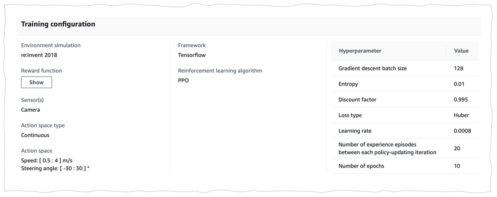
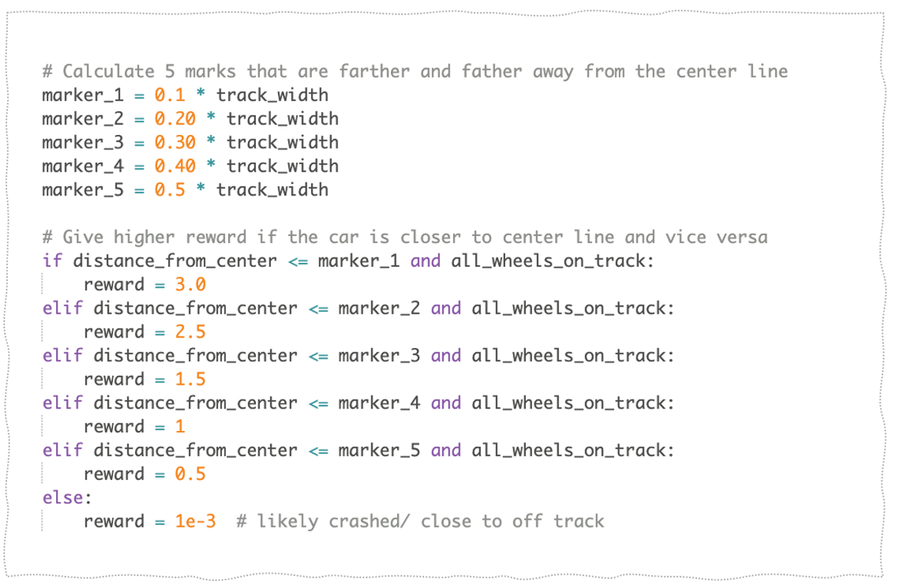

### Background
AWS Deepracer is an innovative educational initiative launched by Amazon Web Services (AWS) designed to introduce and educate users on machine learning (ML) through a fun and engaging method. It is essentially a competition that combines machine learning with a physical, autonomous, 1/18th scale race car driven by reinforcement learning, a type of machine learning technique where an algorithm learns to perform tasks by trying them out and then learning from the outcomes.

Participants in AWS Deepracer engage in developing, training, and fine-tuning reinforcement learning models in a virtual environment provided by AWS. These models are then deployed to the physical Deepracer cars, which compete by racing on a real track. The goal is to create a model that enables the car to complete the track as quickly as possible, autonomously, without human intervention.

### Introduction
This weekend I had the opportunity to participate in the AWS Deepracer competition, organized by the Artificial Intelligence club at UCI. It was a super fun experience that not only challenged my technical skills but also expanded my professional network. This event attracted a diverse group of people, ranging from freshman to seniors to professionals working at Amazon Web Services in the Irvine area. The professionals played a pivotal role in setting up, organizing, and hosting the competition, ensuring an awesome experience for everyone.

I was able to meet so many amazing people from different majors, including software engineering, informatics, and data science. It was an exceptional opportunity to meet new people, share insights, and learn from those with different focuses and expertise in the computer science field. This event not only highlighted the importance of practical hands-on experience in AI and machine learning but also underscored the value of interdisciplinary collaboration and community building within the tech industry.

* Thank you to everybody that organized the event!

### Developing the Model
The idea of developing the model came from the examples provided by AWS for reward functions for DeepRacer. By combining and modifying functions, I tried to explore the performance of the model.

**Model #1:**

- **Agent Configuration:**

The agent used for this model has a continuous action space with a steering angle of 30 degrees. The minimum and maximum speeds are set to 0.5 m/s and 4 m/s, respectively.  

- **Hyperparameters:**

The reinforcement learning algorithm used in this example model is PPO. We have tuned the hyperparameters in a different way than the default one. It helped us explore the result for changes in each hyperparameter. The batch size was changed to 128 to get a more smooth and stable update to the neural network.
We have kept the default value for the entropy and reduced the discount factor. We have used Huber as a loss-type since it is more subtle. We have kept the other parameters the same as default except for the learning rate. Since we have increased the batch size, the learning time has also increased. So, We increased the learning rate to shorten the learning time. The Training configuration used in the example is shown below.

- **Reward Function:**

**Step 1: Distance from the centre**

The reward function utilizes five markers to evaluate the agent's distance from the center. The reward amount varies based on how close the agent is to the center; proximity to the center yields a higher reward. These five markers not only incentivize the agent to collect reward points but also provide multiple options to complete the track more quickly.

